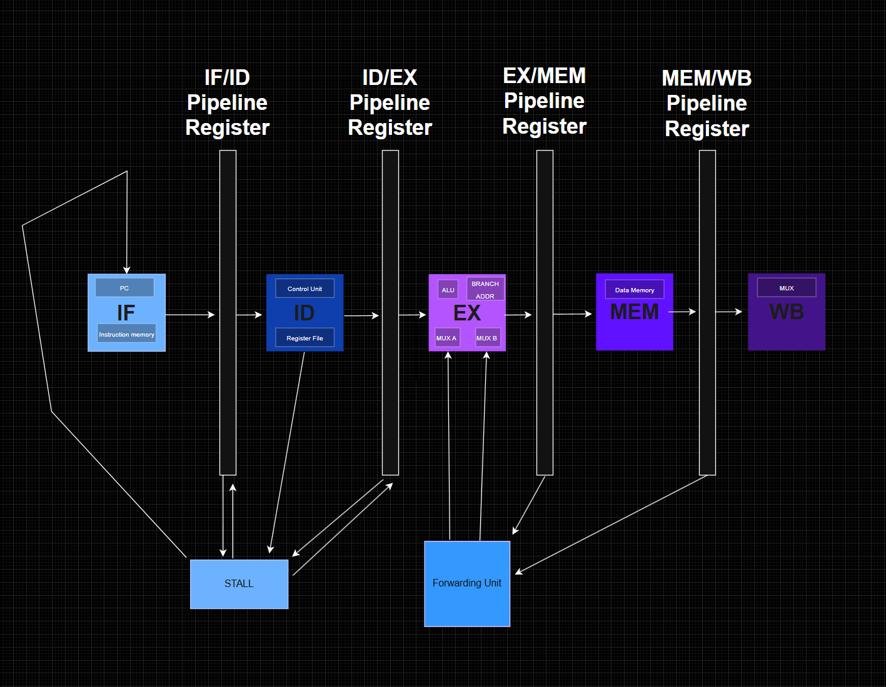

# 16 Bit 5-Stage Pipelined RISC CPU

Overview: A custom 16-bit RISC processor written in SystemVerilog, complete with a 5-stage pipeline, along with data forwarding and stalling for hazard resolution. Includes a custom ISA and a Python assembler. Runs a simulated Fibonacci Sequence written in assembly that overflows at 46368.

## Block Diagram of CPU Architecture and 5-Stage Pipelining Process


## Instruction Set Architecture

### Supported Operations
* ADD, SUB
* AND, OR, XOR, NOT
* SHIFT LEFT, SHIFT RIGHT
* LOAD, STORE, BEQ, HALT

## Pipeline & Hazard Handling
* To bypass data from the EX/MEM and MEM/WB stages, there is a custom forwarding_unit module to prevent the need for waiting for writeback. Instead, it detects instructions that are already sitting in a pipeline register (EX/MEM or MEM/WB) and simply routes it directly into the ALU inputs, as depicted as MUX A and MUX B.

* For load-use-hazards, there is stalling logic which freezes the pipeline for a cycle if memory that is being loaded is also simultaneously needed. If a stall is detected, the PC gets frozen, as well as the IF/ID pipeline, and the ID/Ex pipeline is zeroed out.

* As for branching, there is a `zero_flag` that assigns if the branch `actual_branch` is being used, and the two registers are equal. This way, `actual_branch` can only be 1 is its actually a BEQ instruction AND the two regs were equal. While that's happening, the branch adress is calculated in EX. The immediate being the offset written in assembly. *2-cycle branch penalty*: by the time you know a branch is taken (at the end of the EX stage) the pipeline already fetches 2 more useless instructions after BEQ, so when actual_branch hits the EX/MEM reg, the pipeline loads branch_addr instead of incrementing, and the two wrongly fetched instructions get killed. This impacts performance.

## Custom Assembler
Wrote a Python script `assembler.py` which takes readable assembly and bit-packs it into hex for the instruction memory.

## HOW TO RUN

### Dependencies
* Icarus Verilog
* Python 3

### To Run

```bash
python3 assembler.py

iverilog -g2012 -o cpu_sim cpu_tb.sv cpu.sv alu.sv control_unit.sv register_file.sv program_counter.sv instruction_memory.sv data_memory.sv forwarding_unit.sv

vvp cpu_sim
```
