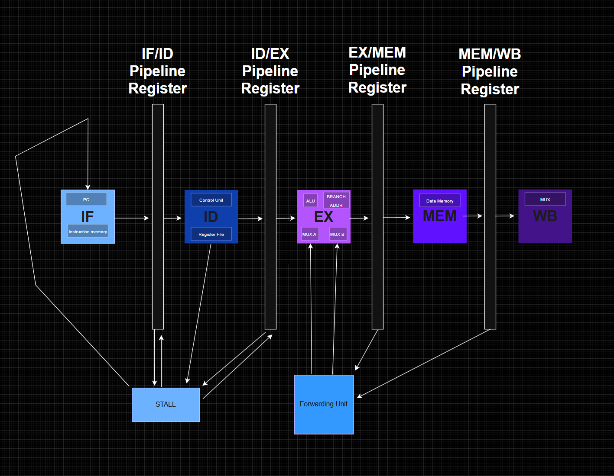
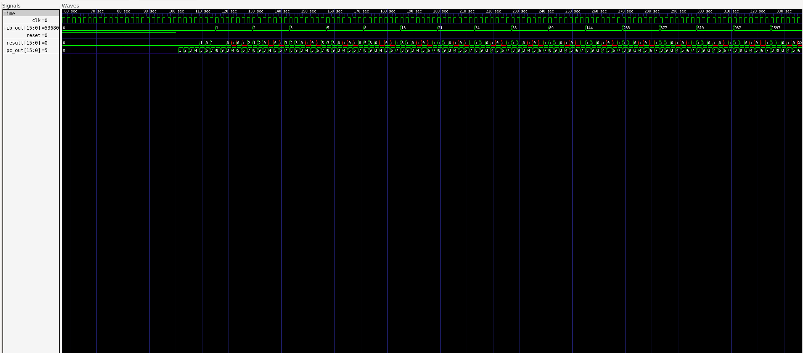

# 16 Bit 5-Stage Pipelined RISC CPU

Overview: A custom 16-bit RISC processor written in SystemVerilog, complete with a 5-stage pipeline, along with data forwarding and stalling for hazard resolution. Includes a custom 12-instruction ISA, a Python assembler, and FPGA deployment on a Gowin Tang Nano 9K with live Fibonacci output on dual TM1637 7-segment displays.

## Demo
https://github.com/user-attachments/assets/442a1684-2e5e-44e8-a177-ca32bde8f09a

## Block Diagram of CPU Architecture and 5-Stage Pipelining Process


## Simulation


## Instruction Set Architecture

### Supported Operations
* ADD, SUB
* AND, OR, XOR, NOT
* SHIFT LEFT, SHIFT RIGHT
* LOAD, STORE, BEQ, HALT

## Pipeline & Hazard Handling
* To bypass data from the EX/MEM and MEM/WB stages, there is a custom forwarding_unit module to prevent the need for waiting for writeback. Instead, it detects instructions that are already sitting in a pipeline register (EX/MEM or MEM/WB) and simply routes them directly into the ALU inputs, as depicted by MUX A and MUX B.

* For load-use-hazards, there is stalling logic which freezes the pipeline for a cycle if the memory that is being loaded is also simultaneously needed. If a stall is detected, the PC gets frozen, as well as the IF/ID pipeline, and the ID/Ex pipeline is zeroed out.

* As for branching, there is a `zero_flag` that is set if the branch `actual_branch` is being used, and the two registers are equal. This way, `actual_branch` can only be 1 if it's actually a BEQ instruction AND the two regs are equal. While that's happening, the branch address is calculated in EX. The immediate being the offset written in assembly. *2-cycle branch penalty*: by the time you know a branch is taken (at the end of the EX stage) the pipeline already fetches 2 more useless instructions after BEQ, so when actual_branch hits the EX/MEM reg, the pipeline loads branch_addr instead of incrementing, and the two wrongly fetched instructions get killed. This impacts performance.

## Custom Assembler
Wrote a Python script `assembler.py` which takes readable assembly and bit-packs it into hex for the instruction memory.

## FPGA Deployment

### Hardware
* FPGA: Gowin Tang Nano 9K (GW1NR-9, QFN88P)
* Display: Two TM1637 4-digit 7-segment display modules (8 digits total)
* Wiring: TM1637 CLK/DIO driven via GPIO  pins 27-30, VCC on 3.3V, GND shared
* Other components: Red LED (pin 31), 100Ω Resistor, a buncha jumper cables

### Architecture on FPGA

The CPU runs on a divided clock (~1.6Hz), so the Fibonacci values are visible as they update on the screen. I put a module ("binary_to_bcd") that converts the 16-bit binary output from the cpu into 5 BCD digits using the double dabble algorithm. A driver for the seven-segment displays sends the segment data to each display over the TM1637's 2-wire serial protocol, handling start/stop conditions, byte transmission, ACK cycles, and brightness.

The Fibonacci sequence runs live on the FPGA, computing each value through the full 5-stage pipeline, and overflows at 46,368. There is a red LED that goes live when that overflow happens.
The sequence goes like this: 1, 1, 2, 3, 5, 8, 13, 21, 34, 55, 89, 144, 233, 377, 610, 987, 1597, 2584, 4181, 6765, 10946, 17711, 28657, 46368... and then it overflows because the registers are 16 bits, so they can hold max 0-65535, the next number after 46368 is 75025, which is greater so it stores 75025 - 65536 = 9489 instead, which is a wrong, smaller number.

### Bugs Fixed during Deployment

* Replaced the simulation-only 'initial' block with a synchronous reset; FPGAs just ignore 'initial' blocks for distributed RAM, so the memory was filled with garbage instead of Fibonacci values.
* Tang Nano button is active-low, CPU is active-high. Inverted the reset in the top module.
* Data memory used full 16-bit address lines for a 256-entry array, causing the synthesizer to build a 65,536-way mux and silently crash. Had to slice to 8 bits.
* among many others, these were just the most prominent.

## HOW TO RUN

### Dependencies
* Icarus Verilog
* Python 3

### To Run

```bash
python3 assembler.py

iverilog -g2012 -o cpu_sim cpu_tb.sv cpu.sv alu.sv control_unit.sv register_file.sv program_counter.sv instruction_memory.sv data_memory.sv forwarding_unit.sv

vvp cpu_sim
```
### FPGA
 
#### Dependencies
* Gowin EDA (IDE + Programmer)
* Tang Nano 9K
#### To Deploy
1. Create a Gowin project targeting GW1NR-LV9QN88PC6/I5 (Device Version C)
2. Add all `.sv` source files and `constraints.cst`
3. Set top module to `top`
4. Run synthesis → place & route → generate bitstream
5. Flash via Tools → Programmer
